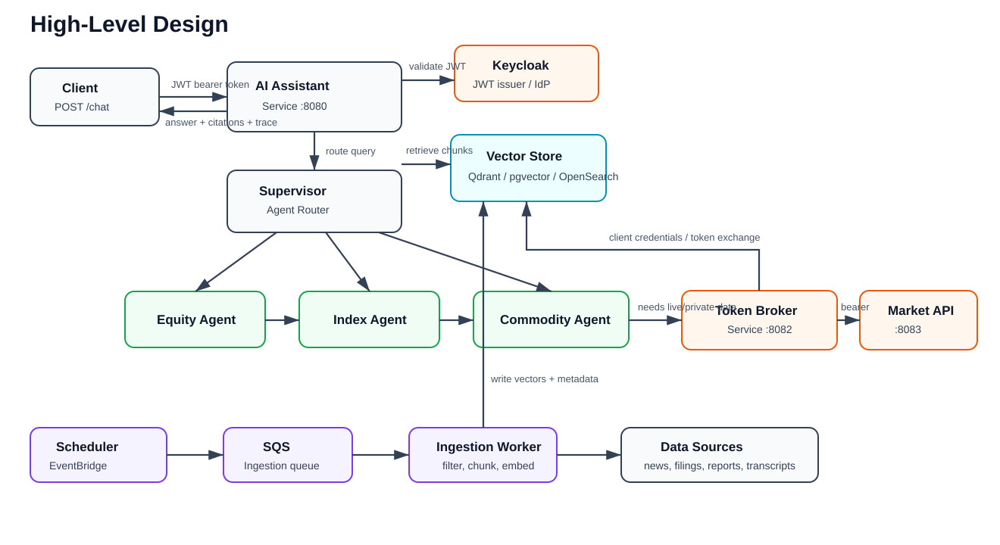
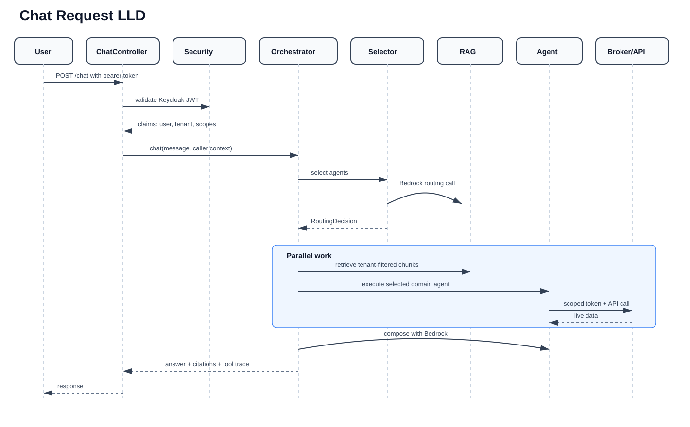
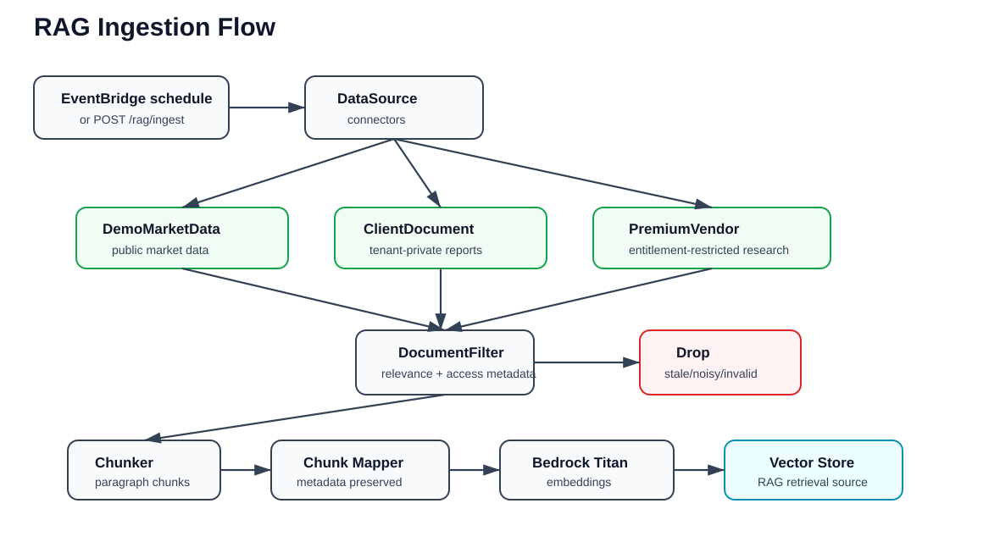
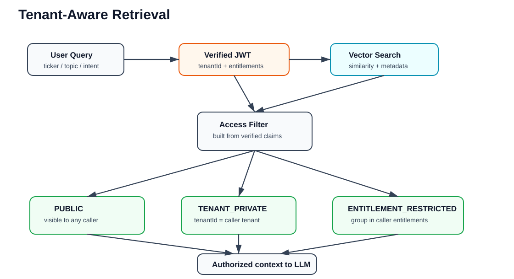
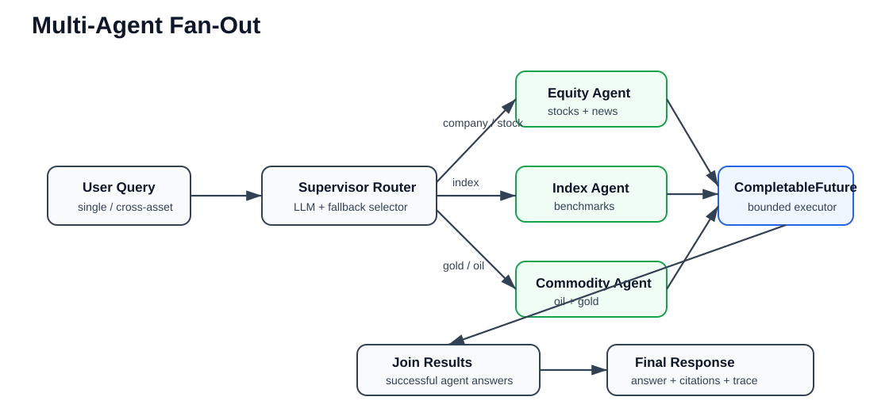
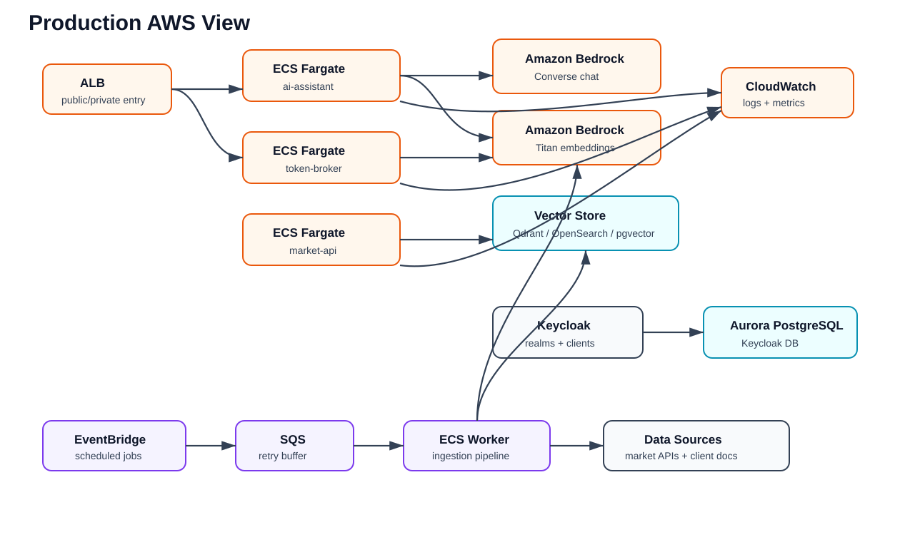

# System Diagrams

This page contains interview-friendly diagrams for the secure multi-agent RAG assistant.

The diagrams are embedded as SVG files so they render in IntelliJ Markdown preview even when the
Mermaid plugin/renderer is not enabled.

## 1. High-Level Design

## 2. Chat Request LLD

## 3. RAG Ingestion Flow

## 4. Tenant-Aware Retrieval

## 5. Multi-Agent Fan-Out

## 6. Production AWS View

